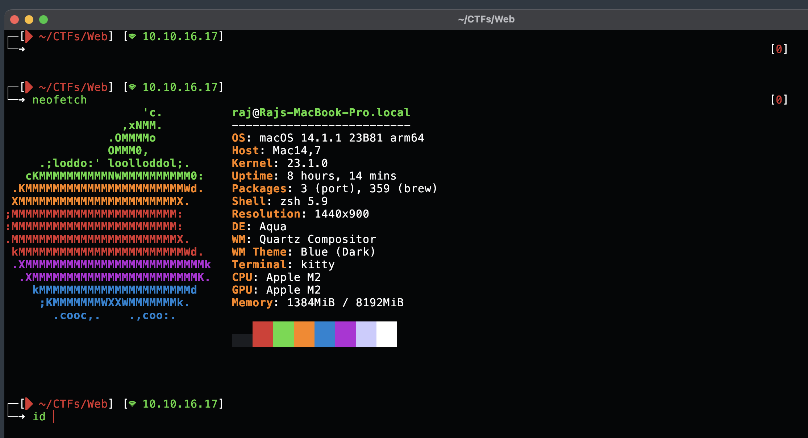

## zsh config(Mac) for Hackers

### Features
- Prints the current working directory
- Prints the tun0 IP if connected to a VPN
- Prints the en0 IP if you aren't connected to any VPN. (change the module name in .zsh-theme according to your wifi module)




### Installation
```
Step 1. go to cd .oh-my-zsh/custom/themes & put the raj.zsh-theme file there
Step 2. put the .zshrc file in ~/.zshrc path (remove the old one after u took backup)
```
